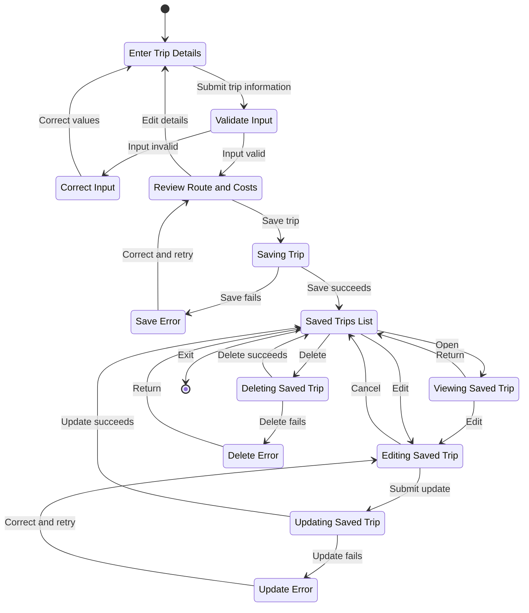

# MyTrip Trip Lifecycle Statechart

This revision keeps the same major behavior while reducing clutter by using a single top-to-bottom workflow, readable quoted state labels, and localized save, update, and delete error states.

Source files reviewed:
- [src/main/java/com/mytrip/controller/TripController.java](src/main/java/com/mytrip/controller/TripController.java)
- [src/main/java/com/mytrip/service/TripService.java](src/main/java/com/mytrip/service/TripService.java)
- [src/main/java/com/mytrip/model/Trip.java](src/main/java/com/mytrip/model/Trip.java)
- [src/main/resources/static/main.js](src/main/resources/static/main.js)