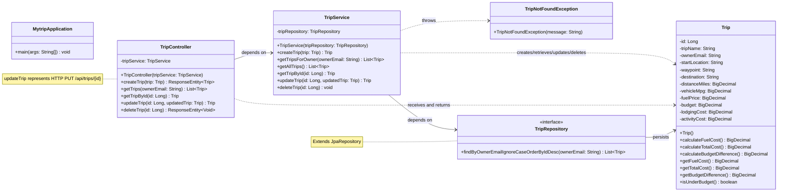

# MyTrip As-Built UML Class Diagram

```mermaid
classDiagram
    direction LR

    class MytripApplication {
        +main(args: String[]) void
    }

    class Trip {
        -id: Long
        -tripName: String
        -ownerEmail: String
        -startLocation: String
        -waypoint: String
        -destination: String
        -distanceMiles: BigDecimal
        -vehicleMpg: BigDecimal
        -fuelPrice: BigDecimal
        -budget: BigDecimal
        -lodgingCost: BigDecimal
        -activityCost: BigDecimal
        +Trip()
        +calculateFuelCost() BigDecimal
        +calculateTotalCost() BigDecimal
        +calculateBudgetDifference() BigDecimal
        +getFuelCost() BigDecimal
        +getTotalCost() BigDecimal
        +getBudgetDifference() BigDecimal
        +isUnderBudget() boolean
    }

    class TripController {
        -tripService: TripService
        +TripController(tripService: TripService)
        +createTrip(trip: Trip) ResponseEntity~Trip~
        +getTrips(ownerEmail: String) List~Trip~
        +getTripById(id: Long) Trip
        +updateTrip(id: Long, updatedTrip: Trip) Trip
        +deleteTrip(id: Long) ResponseEntity~Void~
    }

    class TripService {
        -tripRepository: TripRepository
        +TripService(tripRepository: TripRepository)
        +createTrip(trip: Trip) Trip
        +getTripsForOwner(ownerEmail: String) List~Trip~
        +getAllTrips() List~Trip~
        +getTripById(id: Long) Trip
        +updateTrip(id: Long, updatedTrip: Trip) Trip
        +deleteTrip(id: Long) void
    }

    class TripNotFoundException {
        +TripNotFoundException(message: String)
    }

    class TripRepository {
        <<interface>>
        +findByOwnerEmailIgnoreCaseOrderByIdDesc(ownerEmail: String) List~Trip~
    }

    TripController --> TripService : depends on
    TripService --> TripRepository : depends on
    TripRepository --> Trip : persists
    TripController ..> Trip : receives and returns
    TripService ..> Trip : creates/retrieves/updates/deletes
    TripService ..> TripNotFoundException : throws

    note for TripRepository "Extends JpaRepository<Trip, Long>"
    note for TripController "updateTrip represents HTTP PUT /api/trips/{id}"
```
